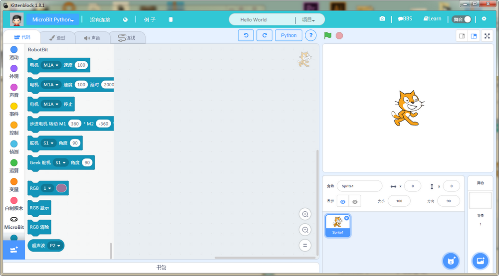
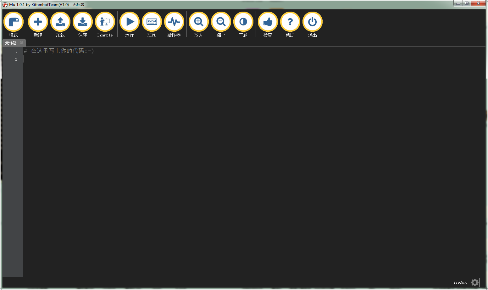
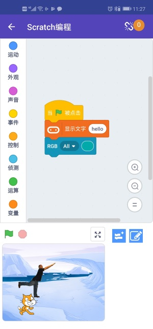

---

## Kittenblock(基于Scratch3.0)

## 最新版本V1.83 下载地址

windows： [http://cdn.kittenbot.cn/win/Kittenblock Setup 1.8.3.exe](http://cdn.kittenbot.cn/win/Kittenblock%20Setup%201.8.3.exe)

mac: [http://cdn.kittenbot.cn/mac/Kittenblock-1.8.3.dmg](http://cdn.kittenbot.cn/mac/Kittenblock-1.8.3.dmg)

历史版本和改进意见请前往我们的bbs发布帖子：
[论坛Kittenblock栏](https://bbs.kittenbot.cn/forum.php?mod=viewthread&tid=115)

---

## Makecode(离线版)

 
Windows (v3.5)：[http://cdn.kittenbot.cn/makecode/win/Makecode Setup 3.5.0.exe](http://cdn.kittenbot.cn/makecode/win/Makecode%20Setup%203.5.0.exe)

绿色版(解压就能用)：[http://cdn.kittenbot.cn/makecode/win/makecode3.4.zip](http://cdn.kittenbot.cn/makecode/win/makecode3.4.zip)

Mac：[http://cdn.kittenbot.cn/makecode/mac/Makecode-3.1.0.dmg](http://cdn.kittenbot.cn/makecode/mac/Makecode-3.1.0.dmg)

`大家也可以前往我们论坛的makecode发布和讨论帖提出bug和修改建议：`
[论坛Makecode栏](https://bbs.kittenbot.cn/forum.php?mod=viewthread&tid=156&extra=page%3D1)

<!-- ## KBlock APP -->

---

## Mu editor(Micropython)

(包含meowbit模式)

[http://cdn.kittenbot.cn/mu/Mu_1.0.1.exe](http://cdn.kittenbot.cn/mu/Mu_1.0.1.exe)

---

## 手机APP

喵家特有的Scratch3手机APP，包括iOS，android版本

IOS请搜索KBlock 或者Kittenbot

Android可以在在[google play下载](https://play.google.com/store/apps/details?id=cc.kittenbot.kblock)

或者直接下载最新版本的[APK安装包](http://cdn.kittenbot.cn/app/kblock235.apk)

### 改进建议和需求都可以在我们论坛和QQ群大胆提出来~

## 小程序

喵家提供了一个用于直接控制Microbit x Robotbit的小程序，需要提前在Microbit上下载蓝牙通信固件

请在Kittenblock中选择Microbit（python）> ble，之后恢复固件。

微信中扫描下面小程序二维码

### PS 也推荐大家使用喵家粉丝大锤大神的敲bit小程序

[敲比特](http://mp.weixin.qq.com/s?__biz=MzU2NjUzNjM3NQ==&mid=2247483696&idx=1&sn=fdd233c70d4de8ba6c0977dc0db3338c&chksm=fcabb0e8cbdc39fe3701534f147bc83f0ea8d3711f3e745a2535caa47905e1243c700830c58f&mpshare=1&scene=23&srcid=0126NuL7mwMy1QXCpMBB9E2f#rd)

## Microbit 0250固件

0250固件:[前往论坛下载](https://bbs.kittenbot.cn/forum.php?mod=viewthread&tid=442&page=1&extra=#pid2029)

---

## 各种驱动程序

Microbit串口驱动：
[mbedWinSerial](http://cdn.kittenbot.cn/mbedWinSerial_16466.exe)

CH340串口驱动：  

[Windows](http://cdn.kittenbot.cn/CH341SER.EXE)

[Mac](http://cdn.kittenbot.cn/CH341SER_MAC.ZIP)

Zdiag过滤驱动安装器：
[https://zadig.akeo.ie/downloads/zadig-2.4.exe](https://zadig.akeo.ie/downloads/zadig-2.4.exe)

<!-- `·PS: 流光溢彩编辑器已经迁移至实验室` -->

