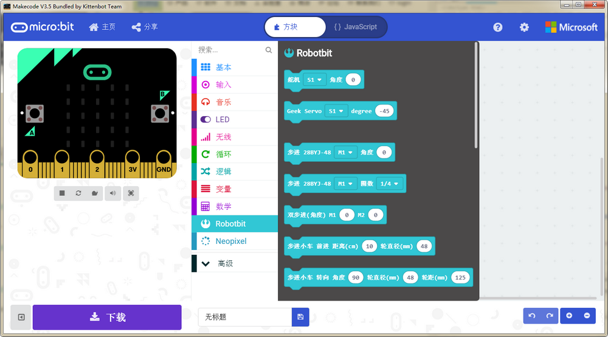

## Kittenblock

## 最新版本V1.80 下载地址

windows： [http://cdn.kittenbot.cn/win/Kittenblock Setup 1.8.0.exe](http://cdn.kittenbot.cn/win/Kittenblock%20Setup%201.8.0.exe)

mac: [http://cdn.kittenbot.cn/mac/Kittenblock-1.8.0.dmg](http://cdn.kittenbot.cn/mac/Kittenblock-1.8.0.dmg)

历史版本和改进意见请前往我们的bbs发布帖子，谢谢 ~

http://kittenbot.cn/bbs/forum.php?mod=viewthread&tid=115

## Makecode

### Windows (v3.4)
 
[http://cdn.kittenbot.cn/makecode/win/Makecode Setup 3.4.0.exe](http://cdn.kittenbot.cn/makecode/win/Makecode%20Setup%203.4.0.exe)

另有绿色版下载，直接解压就能用喽~
 
[http://cdn.kittenbot.cn/makecode/win/makecode3.4.zip](http://cdn.kittenbot.cn/makecode/win/makecode3.4.zip)

### Mac

[http://cdn.kittenbot.cn/makecode/mac/Makecode-3.1.0.dmg](http://cdn.kittenbot.cn/makecode/mac/Makecode-3.1.0.dmg)

大家也可以前往我们论坛的makecode发布和讨论帖提出bug和修改建议：

[论坛Makecode发布帖](http://kittenbot.cn/bbs/forum.php?mod=viewthread&tid=156&extra=page%3D1)

## KBlock APP

## Microbit 0025固件

## 各种驱动程序

### Microbit串口驱动

[mbedWinSerial](http://cdn.kittenbot.cn/mbedWinSerial_16466.exe)

### CH340串口驱动

[Windows](http://cdn.kittenbot.cn/CH341SER.EXE)

[Mac](http://cdn.kittenbot.cn/CH341SER_MAC.ZIP)

### Zdiag过滤驱动安装器

[https://zadig.akeo.ie/downloads/zadig-2.4.exe](https://zadig.akeo.ie/downloads/zadig-2.4.exe)

`·PS: 流光溢彩编辑器已经迁移至实验室`

